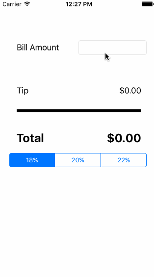

# Pre-work Tip Calculator for Codepath

This application is an exercise to complete the application to Codepath's iOS for Designers bootcamp. There is not a huge investment on design nor a lot of complex code behind it.

Time: I spent about an hour. 

## What does the app do?

* [x] Required: A user can calculate the tip, using diferent percentages 

Walkthrough of the app:

#Optional things I’d still like to do:

* [ ] Optional: Playing with different animations: backgrounds, centers, alphas...
* [ ] Optional: Using different images
* [ ] Optional: Tint of elements on changing percentages
* [ ] Optional: App icon and launch images

The GIF was created with [LiceCap](http://www.cockos.com/licecap/).
